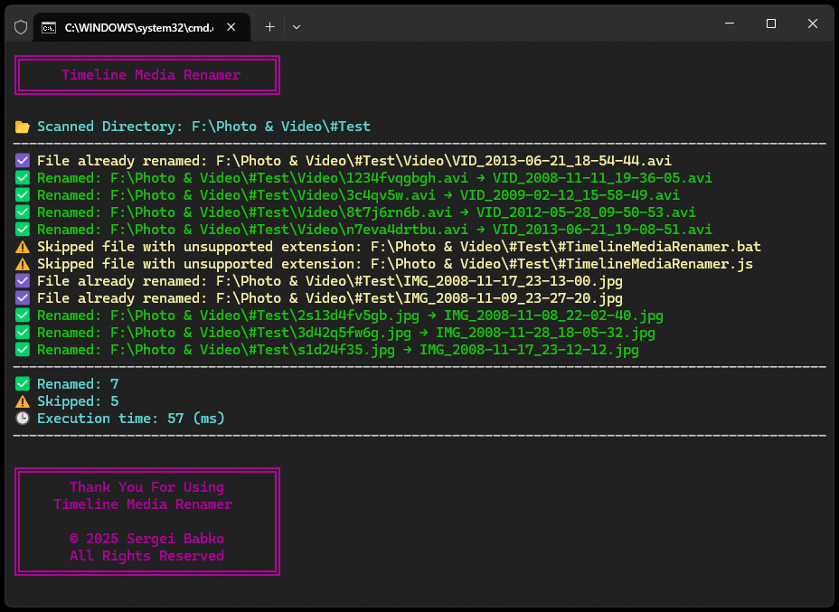

# 🗂 Timeline Media Renamer

<p align="center">
  
</p>

**TimelineMediaRenamer** is a Node.js script that renames your photos and videos using the original creation date from metadata (EXIF) and organizes them with consistent filenames.

---

## 🏷️ Works Great With - [Timeline Media Sorter](https://github.com/SergeiBabko/Timeline-Media-Sorter)

---

## 🔧 What It Does

* Scans all media files in the current directory (recursively)
* Extracts date & time from EXIF metadata by priority:

    * `DateTimeOriginal`
    * `DateTimeCreated`
    * `DateCreated`
    * `DigitalCreationDateTime`
    * `CreationDate`
    * `MediaCreateDate`
    * `ContentCreateDate`
    * `CreateDate`
    * `ModifyDate`
    * `FileModifyDate`
    * `FileCreateDate`

* Renames files to:

    * `IMG_2025-07-09_15-23-41.jpg`
    * `VID_2023-11-01_08-30-02.mp4`

* Adds suffix if the filename already exists
* Skips files with unsupported extensions
* Shows messages in English or Russian, based on your system locale
* Automatically deletes build-related files after renaming
* Gives a short summary with time taken and how many files were renamed

---

## 📦 Supported File Types

The script automatically detects and organizes the following file formats:

### 🖼️ Image & Photo Extensions

```
.jpg, .jpeg, .png, .gif, .bmp, .tiff, .tif, .heic, .heif, .webp,
.raw, .arw, .cr2, .nef, .orf, .sr2, .dng, .rw2, .raf, .psd,
.xcf, .ai, .indd, .svg, .eps, .pdf, .lrtemplate, .xmp
```

### 🎞️ Video Extensions

```
.3gp, .mp4, .mov, .avi, .mkv, .webm, .flv, .wmv, .mpeg, .mpg, .m4v,
.mts, .m2ts, .vob, .rm, .rmvb, .asf, .divx, .xvid, .ogv, .ts, .mxf,
.f4v, .m2v, .mpv, .qt, .mng, .yuv, .y4m, .drc, .f4p, .f4a, .f4b
```

All other file types are skipped automatically.

---

## 🚀 How to Use

1. Install [Node.js](https://nodejs.org)

2. Place the script in the folder with your media files

3. Run the script using one of the following methods:

* Double-click `#TimelineMediaRenamer.bat`
* Or run manually in terminal:

  ```bash
  npm install exiftool-vendored
  node "#TimelineMediaRenamer.js"
  ```

5. Done! Your media files will be renamed based on their capture dates.

---

## 📁 Example Output

```txt
📂 YourMediaFolder
├── 🖼️ IMG_2025-07-09_14-05-21.png
├── 🎞️ VID_2024-12-31_23-59-59.mp4
├── 🖼️ IMG_2023-06-01_10-15-02.jpg
├── 🖼️ IMG_2022-11-15_08-45-30.jpg
└── 🖼️ IMG_2022-11-15_08-45-30_1.jpg
```

---

## ℹ️ Notes

* If no date is found in metadata, the file is skipped
* Already-renamed files are left unchanged
* Original file content is not modified
* Automatically cleans up:

    * `node_modules`
    * `package.json`
    * `package-lock.json`

---

## 📊 After Renaming

* Cleans up dependencies
* Shows how many files were renamed
* Displays the time taken for the operation
* Color-coded console output for better readability
