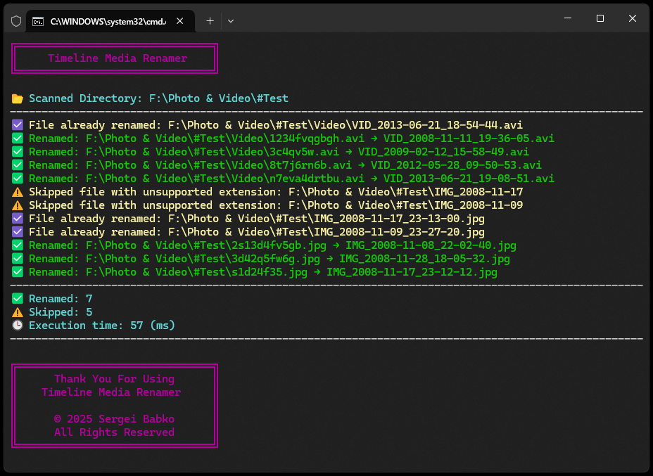

# 🗂 Timeline Media Renamer | [RU](https://github.com/SergeiBabko/Timeline-Media-Renamer/blob/main/README.RU.MD)

<p align="center">
  
</p>

**TimelineMediaRenamer** is a simple Node.js script that renames your photos and videos based on their original creation date from EXIF metadata, bringing all filenames to a consistent format.

---

## 🏷️ Perfect Companion to — [Timeline Media Sorter](https://github.com/SergeiBabko/Timeline-Media-Sorter)

---

## 🔧 Features

* Recursively scans all media files in the current folder
* Extracts date and time from EXIF metadata in the following order of priority:

  * `DateTimeOriginal`
  * `DateTimeCreated`
  * `DateCreated`
  * `DigitalCreationDateTime`
  * `CreationDate`
  * `MediaCreateDate`
  * `ContentCreateDate`
  * `CreateDate`
  * `ModifyDate`
  * `FileModifyDate` *– disabled by default*
  * `FileCreateDate` *– disabled by default*

* Renames files to the format:

  * `IMG_2025-07-09_15-23-41.jpg`
  * `VID_2023-11-01_08-30-02.mp4`

* Adds a suffix if the filename already exists
* Skips files with unsupported extensions
* Automatically detects system language and shows messages in English or Russian
* Cleans up temporary and install-related files after the process
* Displays a summary with total execution time and number of files renamed

---

## 🚀 How to Use

1. Install [Node.js](https://nodejs.org)

2. Place the script in the folder with your media files

3. Launch using one of the following methods:

* Double-click `#TimelineMediaRenamer.bat`
* Or run it manually in a terminal:

  ```bash
  npm install exiftool-vendored
  node "#TimelineMediaRenamer.js"
  ```

5. Done! Your media files will be renamed based on their capture dates.

---

## 📦 Supported File Types

The script automatically processes the following formats:

### 🖼️ Images & Photos

```
.jpg, .jpeg, .png, .gif, .bmp, .tiff, .tif, .heic, .heif, .webp,
.raw, .arw, .cr2, .nef, .orf, .sr2, .dng, .rw2, .raf, .psd,
.xcf, .ai, .indd, .svg, .eps, .pdf, .lrtemplate, .xmp
```

### 🎞️ Videos

```
.3gp, .mp4, .mov, .avi, .mkv, .webm, .flv, .wmv, .mpeg, .mpg, .m4v,
.mts, .m2ts, .vob, .rm, .rmvb, .asf, .divx, .xvid, .ogv, .ts, .mxf,
.f4v, .m2v, .mpv, .qt, .mng, .yuv, .y4m, .drc, .f4p, .f4a, .f4b
```

Other formats are automatically ignored.

---

## 📁 Sample Output

```txt
📂 Photos and Videos
├── 🖼️ IMG_2025-07-09_14-05-21.png
├── 🎞️ VID_2024-12-31_23-59-59.mp4
├── 🖼️ IMG_2023-06-01_10-15-02.jpg
├── 🖼️ IMG_2022-11-15_08-45-30.jpg
└── 🖼️ IMG_2022-11-15_08-45-30_1.jpg
```

---

## ℹ️ Notes

* If no date is found in metadata, the file will be skipped
* Already-renamed files remain untouched
* File contents are never modified
* Automatically deletes:

  * `node_modules`
  * `package.json`
  * `package-lock.json`

---

## 📊 After Completion

* Cleans up temporary dependencies
* Shows how many files were renamed
* Displays the total time taken
* Uses color-coded output for better readability
